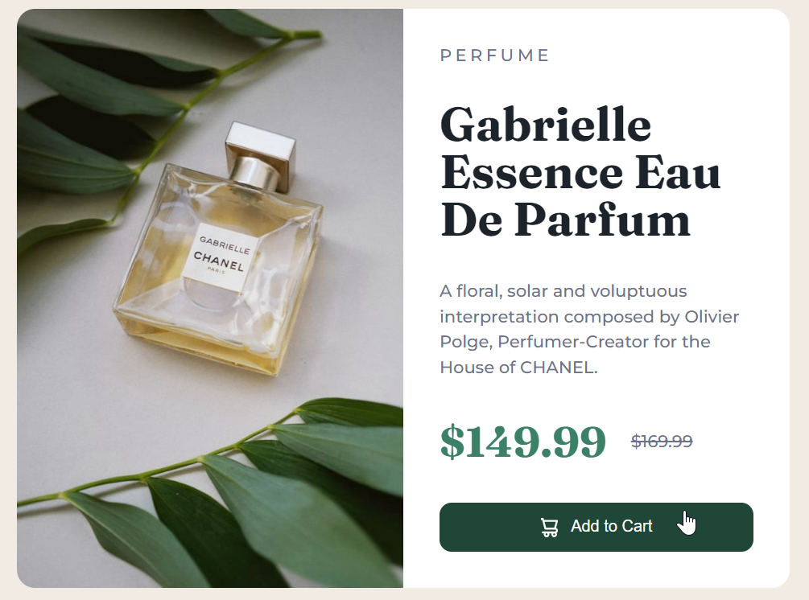

# DOM Assignment 9 Solution

## Task 1

Change text color of heading


- ## Solution

```js
const description=document.querySelector('.caption > h1')
description.style.color="red";
description.style.fontFamily="Times New Roman";
```


## Task 2

Change background of button



- ## Solution

```js
const btn=document.querySelector('.add-to-cart')
btn.style.backgroundColor="red";
```


